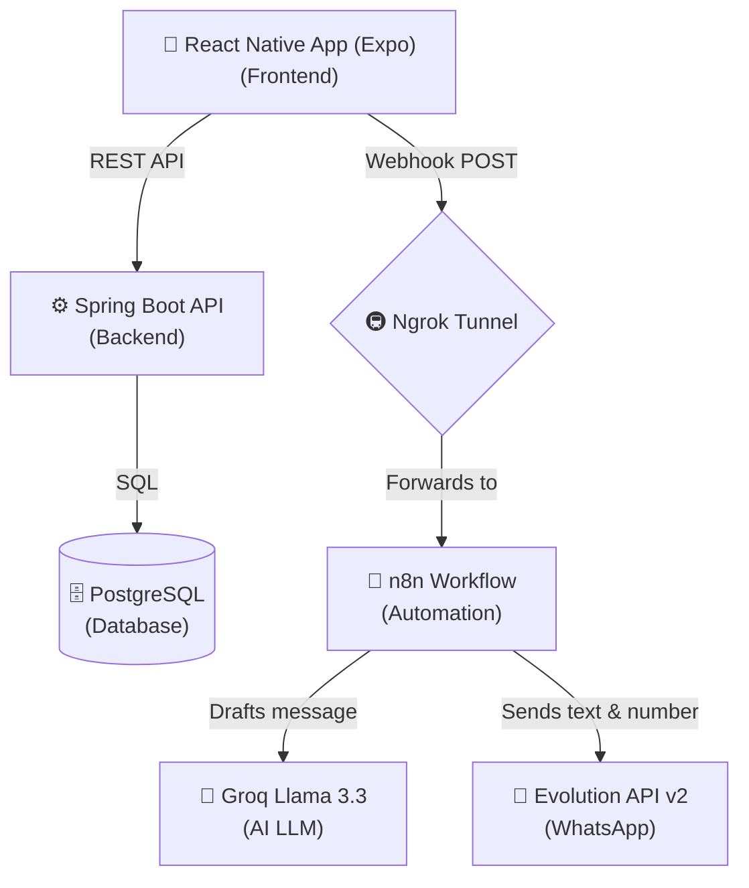

# 🏪 7anoti - Moroccan Grocery Tracker

**7anoti** (My Shop) is a comprehensive, modern Point of Sale (POS) and credit management application specifically tailored for Moroccan local grocers (Moul 7anout). It bridges traditional store management with cutting-edge technology, offering a robust backend, an intuitive mobile frontend, and AI-powered automation.

---

## 🏗️ System Architecture

The application is built on a distributed microservices-style architecture combining mobile client tech, enterprise backends, and low-code AI automation.

### Technology Stack
- **Frontend**: React Native (Expo) with Native UI components, Biometric authentication (`expo-local-authentication`), and PDF rendering (`expo-print`).
- **Backend**: Java 17, Spring Boot, Spring Security, Hibernate ORM.
- **Database**: PostgreSQL.
- **Automation & AI**: n8n (for webhook orchestration), Groq AI (Llama 3.3 for lightning-fast Darija/French text generation).
- **Messaging Integration**: Evolution API v2 (Dockerized WhatsApp client).
- **Tunneling**: Ngrok (Exposes local n8n webhooks to the internet).

---

## ✨ Key Features

1. **Dual-Role Dashboards**
   - **Moul 7anout (Admin)**: Full POS system, client management, daily statistics, and debt tracking.
   - **Client Portal**: Customers can log in to view their own live debt balance, purchase history with images, and directly contact the shopkeeper.
   
2. **AI-Powered WhatsApp Reminders**
   - Automatically drafts highly polite, contextualized debt reminders in Moroccan Darija and French using Llama 3.3.
   - Delivers messages directly to the client's WhatsApp via the Evolution API in seconds.

3. **PDF Invoicing & Sharing**
   - Dynamically compiles beautifully styled HTML receipts for any transaction.
   - Converts to PDF and triggers the native iOS/Android sharing sheet so grocers can send invoices directly to clients.

4. **Biometric Security Bypass**
   - Securely caches credentials locally.
   - Uses FaceID or Fingerprint recognition to instantly bypass manual typing on subsequent logins.

---

## 🚀 Getting Started

If you are setting up the project or restarting your environment, please refer to the exact startup commands documented in the [STARTUP GUIDE](STARTUP_GUIDE.md).

### Quick Boot Summary
1. `docker start maliki_db` (Start Postgres)
2. `.\mvnw spring-boot:run` (Start Spring Boot)
3. `n8n start` & `ngrok http 5678` (Start Automation & Webhooks)
4. `docker start evolution-api` (Start WhatsApp Gateway)
5. `npx expo start -c` (Start Mobile App)

---

## 🔑 Test Accounts

Please refer to the [TEST ACCOUNTS](TEST_ACCOUNTS.md) file for admin and client credentials to test the different roles and layouts inside the mobile app.
